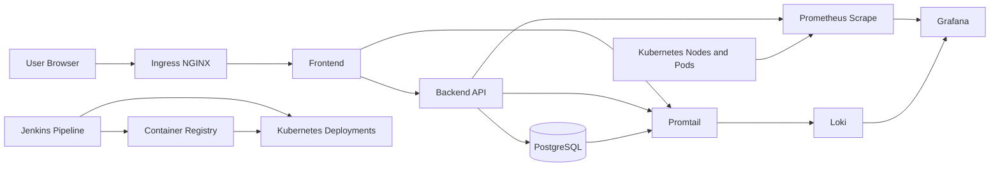

# Architecture Diagram

Editable Draw.io source: [devops-architecture.drawio](devops-architecture.drawio)

Open the `.drawio` file with [diagrams.net](https://app.diagrams.net/) by selecting **File > Open From > Device**, or by downloading it from GitHub and opening it locally in Draw.io Desktop.

