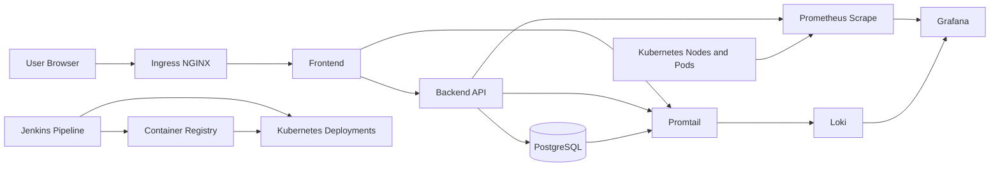

# Architecture Diagram

```mermaid
flowchart LR
  user[User Browser] --> ingress[Ingress NGINX]
  ingress --> web[Frontend]
  web --> api[Backend API]
  api --> db[(PostgreSQL)]

  api --> metrics[Prometheus Scrape]
  kube[Kubernetes Nodes and Pods] --> metrics
  metrics --> grafana[Grafana]
  promtail[Promtail] --> loki[Loki]
  web --> promtail
  api --> promtail
  db --> promtail
  loki --> grafana

  jenkins[Jenkins Pipeline] --> registry[Container Registry]
  jenkins --> k8s[Kubernetes Deployments]
  registry --> k8s
```
